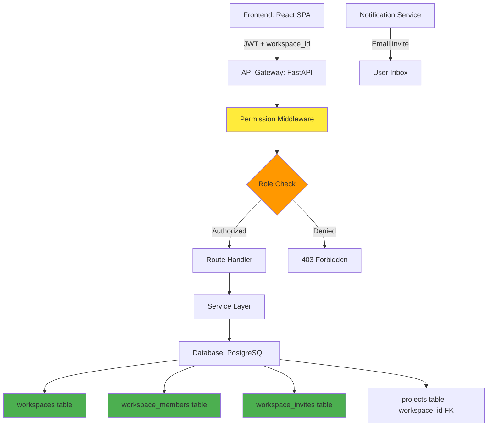
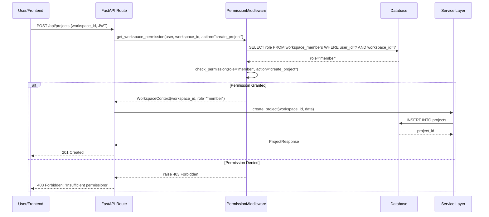
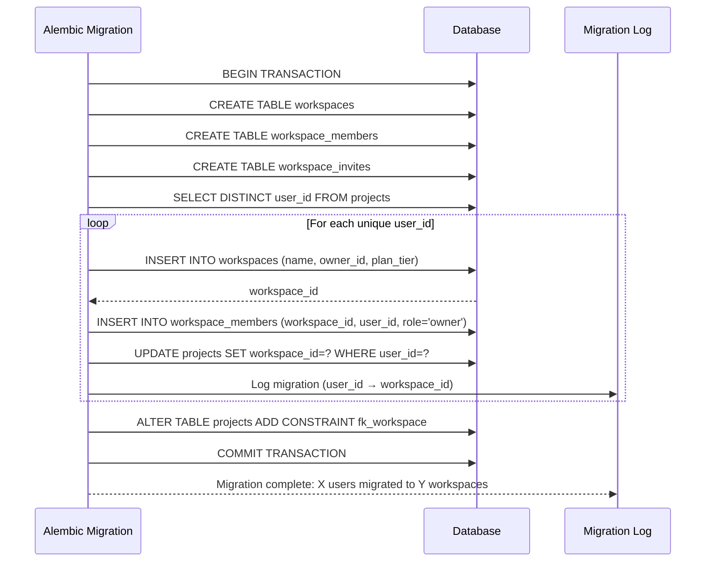
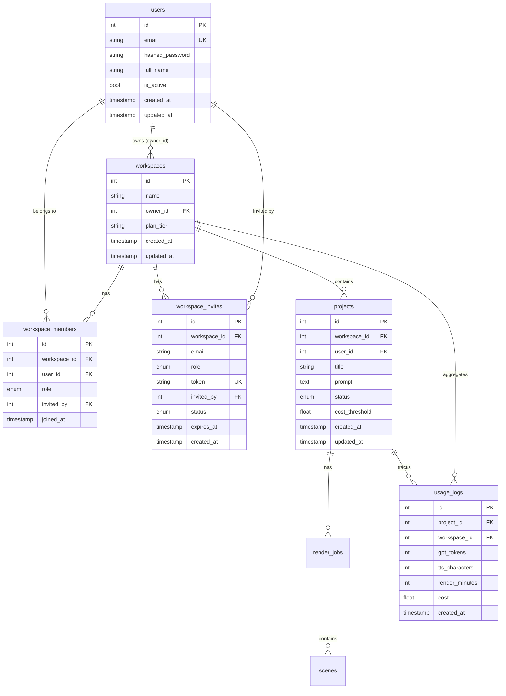

# Design Document: Phase 11 - Multi-User Workspaces & RBAC

## Overview

Phase 11 transforms Yetrix Maritime AI Studio from a single-user MVP to a team-based collaborative platform with role-based access control (RBAC). This upgrade enables teams to work together on projects within shared workspaces while maintaining granular permission control through four distinct roles: owner, admin, member, and viewer.

The design introduces three new database tables (workspaces, workspace_members, workspace_invites), migrates existing single-owner projects to workspace-scoped ownership, implements centralized permission enforcement middleware, and provides a complete invite/member management system. This phase serves as the foundation for future billing (Phase 12) and public API (Phase 13) capabilities.

**Key Design Principles:**
- **Backward Compatibility:** Existing single-owner projects continue working seamlessly after migration
- **Security-First:** Permission checks enforced at the route level via dependency injection
- **Minimal UI Disruption:** Users without team collaboration needs see no difference in UX
- **Extensibility:** Data model supports future subscription tiers and billing without schema changes

## Architecture

### System Components



### Request Flow with Permission Enforcement



### Migration Flow: Single-Owner to Workspaces



## Data Models

### New Tables

#### Table: `workspaces`

Represents a team workspace that owns multiple projects. Every project must belong to exactly one workspace.

| Column | Type | Constraints | Notes |
|--------|------|-------------|-------|
| `id` | INTEGER | PRIMARY KEY, AUTO_INCREMENT | Unique workspace identifier |
| `name` | VARCHAR(255) | NOT NULL | Workspace display name (e.g., "Acme Maritime Team") |
| `owner_id` | INTEGER | FK → users.id, NOT NULL | Workspace creator and ultimate owner |
| `plan_tier` | VARCHAR(50) | DEFAULT 'free' | Billing plan stub: 'free', 'pro', 'enterprise' |
| `created_at` | TIMESTAMP | NOT NULL, DEFAULT NOW() | Creation timestamp |
| `updated_at` | TIMESTAMP | NOT NULL, DEFAULT NOW() | Last modification timestamp |

**Indexes:** `id` (primary), `owner_id` (foreign key)

**Business Rules:**
- One user can own multiple workspaces
- Workspace name is not unique (scoped to owner for display only)
- `plan_tier` is a stub for Phase 12 billing—no billing logic in Phase 11
- Deleting a workspace cascades to workspace_members, workspace_invites, and projects

#### Table: `workspace_members`

Junction table linking users to workspaces with their assigned role.

| Column | Type | Constraints | Notes |
|--------|------|-------------|-------|
| `id` | INTEGER | PRIMARY KEY, AUTO_INCREMENT | Unique membership identifier |
| `workspace_id` | INTEGER | FK → workspaces.id, NOT NULL | Workspace being joined |
| `user_id` | INTEGER | FK → users.id, NOT NULL | User who is a member |
| `role` | ENUM | NOT NULL | One of: 'owner', 'admin', 'member', 'viewer' |
| `invited_by` | INTEGER | FK → users.id, NULLABLE | User who sent the invite (NULL for owner) |
| `joined_at` | TIMESTAMP | NOT NULL, DEFAULT NOW() | When user accepted invite |

**Indexes:** `workspace_id`, `user_id`, UNIQUE(workspace_id, user_id)

**Business Rules:**
- One user can have exactly one role per workspace
- UNIQUE constraint prevents duplicate memberships
- `invited_by` is NULL for the workspace owner (auto-created during workspace creation)
- Role can be changed by admins/owner via PATCH endpoint
- Deleting a workspace cascades to all memberships

#### Table: `workspace_invites`

Pending invitations to join a workspace. Single-use tokens with expiration.

| Column | Type | Constraints | Notes |
|--------|------|-------------|-------|
| `id` | INTEGER | PRIMARY KEY, AUTO_INCREMENT | Unique invite identifier |
| `workspace_id` | INTEGER | FK → workspaces.id, NOT NULL | Workspace being joined |
| `email` | VARCHAR(255) | NOT NULL | Email address of invitee |
| `role` | ENUM | NOT NULL | Role to grant: 'admin', 'member', 'viewer' (NOT 'owner') |
| `token` | VARCHAR(255) | UNIQUE, NOT NULL | Single-use UUID token for accept URL |
| `invited_by` | INTEGER | FK → users.id, NOT NULL | User who created this invite |
| `status` | ENUM | NOT NULL, DEFAULT 'pending' | 'pending', 'accepted', 'revoked', 'expired' |
| `expires_at` | TIMESTAMP | NOT NULL | Token expiration (default: 7 days from creation) |
| `created_at` | TIMESTAMP | NOT NULL, DEFAULT NOW() | Invite creation timestamp |

**Indexes:** `workspace_id`, `token` (unique), `email`

**Business Rules:**
- Token is a UUID v4 generated at creation
- Default expiration: 7 days from `created_at`
- Once accepted, status changes to 'accepted' and token cannot be reused
- Revoking an invite sets status to 'revoked'
- Expired invites (NOW() > expires_at) cannot be accepted (enforced in API)
- Cannot invite 'owner' role—only workspace owner can transfer ownership via separate endpoint
- If invitee email already has a user account, accepting creates membership immediately
- If invitee email is new, accepting redirects to registration flow with invite token preserved

### Modified Tables

#### Table: `projects` (Changes)

**New Column:**
- `workspace_id` INTEGER FK → workspaces.id, NOT NULL

**Removed Implicit Ownership:**
- `user_id` column remains for backward compatibility (tracks original creator) but is NO LONGER the primary ownership mechanism
- Ownership is now determined by workspace membership + role

**Migration Strategy:**
1. For each existing project, create a default workspace owned by `projects.user_id`
2. Set workspace name to "{user.full_name}'s Workspace" or "{user.email}'s Workspace"
3. Link project to new workspace via `projects.workspace_id`
4. Create workspace_member entry with role='owner' for the original user

#### Table: `usage_logs` (Changes)

**New Column:**
- `workspace_id` INTEGER FK → workspaces.id, NULLABLE

**Purpose:**
- Enables workspace-level cost aggregation for Phase 12 billing
- `project_id` remains for granular tracking
- Query pattern: `SELECT SUM(cost_usd) FROM usage_logs WHERE workspace_id=? GROUP BY project_id`

**Migration Strategy:**
- For existing usage_logs, backfill `workspace_id` from `projects.workspace_id` via JOIN

### Entity Relationship Diagram



## RBAC Permission Matrix

### Role Definitions

| Role | Description | Use Case |
|------|-------------|----------|
| **owner** | Full control over workspace including deletion and ownership transfer | Workspace creator, team lead, billing administrator |
| **admin** | Manage projects and members, cannot delete workspace or transfer ownership | Project manager, team coordinator |
| **member** | Create and edit projects, cannot invite members or manage workspace | Content creator, animator, developer |
| **viewer** | Read-only access to all projects and workspace data | Stakeholder, client, auditor |

### Permission Table

| Action | Owner | Admin | Member | Viewer | Non-Member |
|--------|-------|-------|--------|--------|------------|
| **Workspace Management** |
| View workspace details | ✅ | ✅ | ✅ | ✅ | ❌ |
| Edit workspace name | ✅ | ✅ | ❌ | ❌ | ❌ |
| Delete workspace | ✅ | ❌ | ❌ | ❌ | ❌ |
| Transfer ownership | ✅ | ❌ | ❌ | ❌ | ❌ |
| View plan tier | ✅ | ✅ | ✅ | ✅ | ❌ |
| **Member Management** |
| View member list | ✅ | ✅ | ✅ | ✅ | ❌ |
| Invite new member | ✅ | ✅ | ❌ | ❌ | ❌ |
| Revoke pending invite | ✅ | ✅ | ❌ | ❌ | ❌ |
| Remove member | ✅ | ✅ | ❌ | ❌ | ❌ |
| Change member role | ✅ | ✅ | ❌ | ❌ | ❌ |
| Leave workspace | ✅* | ✅ | ✅ | ✅ | ❌ |
| **Project Management** |
| View project list | ✅ | ✅ | ✅ | ✅ | ❌ |
| View project details | ✅ | ✅ | ✅ | ✅ | ❌ |
| Create project | ✅ | ✅ | ✅ | ❌ | ❌ |
| Edit project | ✅ | ✅ | ✅ | ❌ | ❌ |
| Delete project | ✅ | ✅ | ✅** | ❌ | ❌ |
| **Render Management** |
| View render jobs | ✅ | ✅ | ✅ | ✅ | ❌ |
| Start render | ✅ | ✅ | ✅ | ❌ | ❌ |
| Cancel render | ✅ | ✅ | ✅** | ❌ | ❌ |
| Download output | ✅ | ✅ | ✅ | ✅ | ❌ |
| **Asset Library** |
| View assets | ✅ | ✅ | ✅ | ✅ | ❌ |
| Upload assets | ✅ | ✅ | ✅ | ❌ | ❌ |
| Delete assets | ✅ | ✅ | ❌ | ❌ | ❌ |
| **Usage & Billing** |
| View workspace usage | ✅ | ✅ | ✅ | ✅ | ❌ |
| View project-level costs | ✅ | ✅ | ✅ | ✅ | ❌ |
| Set cost thresholds | ✅ | ✅ | ❌ | ❌ | ❌ |

**Notes:**
- *Owner cannot leave workspace without transferring ownership first
- **Members can only delete/cancel their own projects/renders (future enhancement: track project creator)

### Error Response Strategy

**Design Decision: 403 vs 404 for Security**

**Chosen Approach: 403 Forbidden with clear error messages**

**Rationale:**
- **UX Clarity:** Users understand why they can't perform an action
- **Developer Experience:** Frontend can show contextual help ("Ask an admin to grant you access")
- **Security-Through-Obscurity Not Needed:** Workspace membership is already verified before route execution
- **Audit Trail:** Clear 403 logs help with compliance and debugging

**Alternative Considered:** 404 Not Found for all permission failures (security through obscurity)
- **Rejected:** Confusing UX, harder to debug, minimal security benefit in authenticated system


## Core Interfaces and Types

### Python Backend Models

```python
from enum import Enum
from sqlalchemy import Column, Integer, String, ForeignKey, Enum as SQLEnum, UniqueConstraint
from sqlalchemy.orm import relationship
from backend.database import Base

class WorkspaceRoleEnum(str, Enum):
    """Workspace member roles."""
    OWNER = "owner"
    ADMIN = "admin"
    MEMBER = "member"
    VIEWER = "viewer"

class InviteStatusEnum(str, Enum):
    """Workspace invite status."""
    PENDING = "pending"
    ACCEPTED = "accepted"
    REVOKED = "revoked"
    EXPIRED = "expired"

class Workspace(Base):
    """Workspace model - owns projects and has members."""
    __tablename__ = "workspaces"
    
    id = Column(Integer, primary_key=True, index=True)
    name = Column(String(255), nullable=False)
    owner_id = Column(Integer, ForeignKey("users.id"), nullable=False)
    plan_tier = Column(String(50), default="free", nullable=False)
    created_at = Column(DateTime, default=datetime.utcnow, nullable=False)
    updated_at = Column(DateTime, default=datetime.utcnow, onupdate=datetime.utcnow, nullable=False)
    
    # Relationships
    owner = relationship("User", back_populates="owned_workspaces")
    members = relationship("WorkspaceMember", back_populates="workspace", cascade="all, delete-orphan")
    invites = relationship("WorkspaceInvite", back_populates="workspace", cascade="all, delete-orphan")
    projects = relationship("Project", back_populates="workspace", cascade="all, delete-orphan")
    usage_logs = relationship("UsageLog", back_populates="workspace")

class WorkspaceMember(Base):
    """Workspace membership with role."""
    __tablename__ = "workspace_members"
    
    id = Column(Integer, primary_key=True, index=True)
    workspace_id = Column(Integer, ForeignKey("workspaces.id"), nullable=False)
    user_id = Column(Integer, ForeignKey("users.id"), nullable=False)
    role = Column(SQLEnum(WorkspaceRoleEnum), nullable=False)
    invited_by = Column(Integer, ForeignKey("users.id"), nullable=True)
    joined_at = Column(DateTime, default=datetime.utcnow, nullable=False)
    
    # Relationships
    workspace = relationship("Workspace", back_populates="members")
    user = relationship("User", foreign_keys=[user_id])
    inviter = relationship("User", foreign_keys=[invited_by])
    
    __table_args__ = (
        UniqueConstraint('workspace_id', 'user_id', name='uq_workspace_user'),
    )

class WorkspaceInvite(Base):
    """Pending workspace invitation."""
    __tablename__ = "workspace_invites"
    
    id = Column(Integer, primary_key=True, index=True)
    workspace_id = Column(Integer, ForeignKey("workspaces.id"), nullable=False)
    email = Column(String(255), nullable=False, index=True)
    role = Column(SQLEnum(WorkspaceRoleEnum), nullable=False)
    token = Column(String(255), unique=True, nullable=False, index=True)
    invited_by = Column(Integer, ForeignKey("users.id"), nullable=False)
    status = Column(SQLEnum(InviteStatusEnum), default=InviteStatusEnum.PENDING, nullable=False)
    expires_at = Column(DateTime, nullable=False)
    created_at = Column(DateTime, default=datetime.utcnow, nullable=False)
    
    # Relationships
    workspace = relationship("Workspace", back_populates="invites")
    inviter = relationship("User", foreign_keys=[invited_by])
```

### Pydantic Schemas (API Contracts)

```python
from pydantic import BaseModel, EmailStr
from typing import Optional, List
from datetime import datetime

# Workspace Schemas
class WorkspaceCreate(BaseModel):
    """Request to create a workspace."""
    name: str

class WorkspaceUpdate(BaseModel):
    """Request to update workspace."""
    name: Optional[str] = None

class WorkspaceResponse(BaseModel):
    """Workspace info response."""
    id: int
    name: str
    owner_id: int
    plan_tier: str
    created_at: datetime
    updated_at: datetime
    
    class Config:
        from_attributes = True

class WorkspaceMemberResponse(BaseModel):
    """Workspace member info."""
    id: int
    workspace_id: int
    user_id: int
    user_email: str  # Joined from users table
    user_full_name: Optional[str]
    role: str
    joined_at: datetime
    
    class Config:
        from_attributes = True

# Invite Schemas
class InviteCreate(BaseModel):
    """Request to create an invite."""
    email: EmailStr
    role: str  # "admin", "member", or "viewer" (not "owner")

class InviteResponse(BaseModel):
    """Invite info response."""
    id: int
    workspace_id: int
    email: str
    role: str
    token: str
    invited_by: int
    status: str
    expires_at: datetime
    created_at: datetime
    
    class Config:
        from_attributes = True

class InviteAccept(BaseModel):
    """Request to accept an invite."""
    token: str

# Member Management Schemas
class MemberRoleUpdate(BaseModel):
    """Request to change member role."""
    role: str  # "owner", "admin", "member", or "viewer"

class OwnershipTransfer(BaseModel):
    """Request to transfer workspace ownership."""
    new_owner_user_id: int

# Permission Context
class WorkspaceContext(BaseModel):
    """Workspace context injected by permission middleware."""
    workspace_id: int
    user_id: int
    role: str
    
    def has_permission(self, action: str) -> bool:
        """Check if role has permission for action."""
        return check_permission(self.role, action)
```

### TypeScript Frontend Interfaces

```typescript
// Workspace Types
export interface Workspace {
  id: number
  name: string
  owner_id: number
  plan_tier: string
  created_at: string
  updated_at: string
}

export interface WorkspaceMember {
  id: number
  workspace_id: number
  user_id: number
  user_email: string
  user_full_name?: string
  role: 'owner' | 'admin' | 'member' | 'viewer'
  joined_at: string
}

export interface WorkspaceInvite {
  id: number
  workspace_id: number
  email: string
  role: 'admin' | 'member' | 'viewer'
  token: string
  invited_by: number
  status: 'pending' | 'accepted' | 'revoked' | 'expired'
  expires_at: string
  created_at: string
}

export type WorkspaceRole = 'owner' | 'admin' | 'member' | 'viewer'

// Permission helper
export function hasPermission(role: WorkspaceRole, action: string): boolean {
  const permissions: Record<WorkspaceRole, string[]> = {
    owner: ['*'], // All permissions
    admin: [
      'view_workspace', 'edit_workspace', 'view_members', 'invite_member', 
      'remove_member', 'change_role', 'create_project', 'edit_project', 
      'delete_project', 'start_render', 'view_usage'
    ],
    member: [
      'view_workspace', 'view_members', 'create_project', 'edit_project', 
      'delete_own_project', 'start_render', 'view_usage'
    ],
    viewer: [
      'view_workspace', 'view_members', 'view_projects', 'view_renders', 
      'view_usage', 'download_output'
    ]
  }
  
  return role === 'owner' || permissions[role]?.includes(action) || false
}
```

## Key Functions with Formal Specifications

### Function 1: check_workspace_permission()

**Purpose:** Central permission enforcement function used by all protected routes.

```python
def check_workspace_permission(
    workspace_id: int,
    user_id: int,
    required_action: str,
    db: Session
) -> WorkspaceContext
```

**Preconditions:**
- `workspace_id` is a valid workspace ID (exists in database)
- `user_id` is a valid user ID (exists in database)
- `required_action` is a known action string from the permission matrix
- `db` is an active database session

**Postconditions:**
- Returns `WorkspaceContext` with user's role if permission is granted
- Raises `HTTPException(403)` if user lacks the required permission
- Raises `HTTPException(404)` if user is not a member of the workspace
- No database mutations occur (read-only operation)

**Algorithm:**

```python
ALGORITHM check_workspace_permission(workspace_id, user_id, required_action, db)
INPUT: 
  workspace_id: integer (workspace identifier)
  user_id: integer (user identifier)
  required_action: string (action to check)
  db: database session
OUTPUT: WorkspaceContext or HTTPException

BEGIN
  // Step 1: Verify workspace exists
  workspace ← db.query(Workspace).filter(id = workspace_id).first()
  IF workspace IS NULL THEN
    RAISE HTTPException(404, "Workspace not found")
  END IF
  
  // Step 2: Get user's membership and role
  membership ← db.query(WorkspaceMember)
    .filter(workspace_id = workspace_id AND user_id = user_id)
    .first()
  
  IF membership IS NULL THEN
    RAISE HTTPException(403, "You are not a member of this workspace")
  END IF
  
  role ← membership.role
  
  // Step 3: Check permission matrix
  has_permission ← check_permission(role, required_action)
  
  IF NOT has_permission THEN
    RAISE HTTPException(403, "Insufficient permissions for action: " + required_action)
  END IF
  
  // Step 4: Return context for route handler
  RETURN WorkspaceContext(
    workspace_id=workspace_id,
    user_id=user_id,
    role=role
  )
END
```

### Function 2: check_permission()

**Purpose:** Pure function that evaluates if a role has permission for an action.

```python
def check_permission(role: WorkspaceRoleEnum, action: str) -> bool
```

**Preconditions:**
- `role` is a valid WorkspaceRoleEnum value
- `action` is a non-empty string

**Postconditions:**
- Returns `True` if role has permission for action
- Returns `False` otherwise
- No side effects (pure function)

**Algorithm:**

```python
ALGORITHM check_permission(role, action)
INPUT: 
  role: enum (owner, admin, member, viewer)
  action: string (e.g., "create_project", "delete_workspace")
OUTPUT: boolean

BEGIN
  // Owner has all permissions
  IF role = "owner" THEN
    RETURN true
  END IF
  
  // Define permission sets for each role
  admin_permissions ← [
    "view_workspace", "edit_workspace", "view_members", 
    "invite_member", "remove_member", "change_role",
    "create_project", "edit_project", "delete_project",
    "start_render", "cancel_render", "view_usage", "set_cost_threshold"
  ]
  
  member_permissions ← [
    "view_workspace", "view_members", "create_project", 
    "edit_project", "delete_own_project", "start_render", 
    "cancel_own_render", "view_usage"
  ]
  
  viewer_permissions ← [
    "view_workspace", "view_members", "view_projects", 
    "view_renders", "view_usage", "download_output"
  ]
  
  // Check role-specific permissions
  IF role = "admin" THEN
    RETURN action IN admin_permissions
  ELSE IF role = "member" THEN
    RETURN action IN member_permissions
  ELSE IF role = "viewer" THEN
    RETURN action IN viewer_permissions
  ELSE
    RETURN false
  END IF
END
```

### Function 3: create_workspace_invite()

**Purpose:** Generate and persist a workspace invitation with token and expiration.

```python
def create_workspace_invite(
    workspace_id: int,
    email: str,
    role: WorkspaceRoleEnum,
    invited_by: int,
    db: Session
) -> WorkspaceInvite
```

**Preconditions:**
- `workspace_id` is a valid workspace ID
- `email` is a valid email address (validated by Pydantic)
- `role` is one of: admin, member, viewer (NOT owner)
- `invited_by` is a valid user ID who has permission to invite
- `db` is an active database session

**Postconditions:**
- Returns newly created `WorkspaceInvite` object
- Invite token is a unique UUID v4
- Invite status is 'pending'
- Invite expires in 7 days from creation
- Email notification is sent to invitee (via notification service)
- Database contains new invite record

**Algorithm:**

```python
ALGORITHM create_workspace_invite(workspace_id, email, role, invited_by, db)
INPUT: 
  workspace_id: integer
  email: string
  role: enum (admin, member, viewer)
  invited_by: integer
  db: database session
OUTPUT: WorkspaceInvite

BEGIN
  // Step 1: Validate role (cannot invite owner)
  IF role = "owner" THEN
    RAISE HTTPException(400, "Cannot invite owner role. Use transfer ownership instead.")
  END IF
  
  // Step 2: Check if user is already a member
  existing_member ← db.query(WorkspaceMember)
    .join(User)
    .filter(WorkspaceMember.workspace_id = workspace_id AND User.email = email)
    .first()
  
  IF existing_member IS NOT NULL THEN
    RAISE HTTPException(409, "User is already a member of this workspace")
  END IF
  
  // Step 3: Check if there's already a pending invite
  existing_invite ← db.query(WorkspaceInvite)
    .filter(workspace_id = workspace_id AND email = email AND status = "pending")
    .first()
  
  IF existing_invite IS NOT NULL THEN
    RAISE HTTPException(409, "An active invite already exists for this email")
  END IF
  
  // Step 4: Generate unique token
  token ← generate_uuid_v4()
  
  // Step 5: Create invite record
  invite ← WorkspaceInvite(
    workspace_id=workspace_id,
    email=email,
    role=role,
    token=token,
    invited_by=invited_by,
    status="pending",
    expires_at=NOW() + INTERVAL 7 DAYS,
    created_at=NOW()
  )
  
  db.add(invite)
  db.commit()
  db.refresh(invite)
  
  // Step 6: Send email notification (async, non-blocking)
  send_invite_email(email, token, workspace_id, role)
  
  RETURN invite
END
```

### Function 4: accept_workspace_invite()

**Purpose:** Process invite acceptance, create membership, and update invite status.

```python
def accept_workspace_invite(token: str, user_id: int, db: Session) -> WorkspaceMember
```

**Preconditions:**
- `token` is a valid invite token string
- `user_id` is a valid authenticated user ID
- `db` is an active database session

**Postconditions:**
- Returns newly created `WorkspaceMember` if successful
- Invite status changes from 'pending' to 'accepted'
- New membership record created with specified role
- Raises `HTTPException(404)` if token doesn't exist
- Raises `HTTPException(400)` if invite is expired or already used
- Raises `HTTPException(409)` if user is already a member

**Algorithm:**

```python
ALGORITHM accept_workspace_invite(token, user_id, db)
INPUT: 
  token: string (UUID token from invite)
  user_id: integer (authenticated user accepting invite)
  db: database session
OUTPUT: WorkspaceMember

BEGIN
  // Step 1: Find invite by token
  invite ← db.query(WorkspaceInvite).filter(token = token).first()
  
  IF invite IS NULL THEN
    RAISE HTTPException(404, "Invite not found")
  END IF
  
  // Step 2: Validate invite status and expiration
  IF invite.status ≠ "pending" THEN
    RAISE HTTPException(400, "Invite has already been used or revoked")
  END IF
  
  IF NOW() > invite.expires_at THEN
    invite.status ← "expired"
    db.commit()
    RAISE HTTPException(400, "Invite has expired")
  END IF
  
  // Step 3: Get user email and verify it matches invite
  user ← db.query(User).filter(id = user_id).first()
  
  IF user.email ≠ invite.email THEN
    RAISE HTTPException(403, "This invite was sent to a different email address")
  END IF
  
  // Step 4: Check if user is already a member
  existing_member ← db.query(WorkspaceMember)
    .filter(workspace_id = invite.workspace_id AND user_id = user_id)
    .first()
  
  IF existing_member IS NOT NULL THEN
    RAISE HTTPException(409, "You are already a member of this workspace")
  END IF
  
  // Step 5: Create workspace membership
  membership ← WorkspaceMember(
    workspace_id=invite.workspace_id,
    user_id=user_id,
    role=invite.role,
    invited_by=invite.invited_by,
    joined_at=NOW()
  )
  
  db.add(membership)
  
  // Step 6: Update invite status
  invite.status ← "accepted"
  
  db.commit()
  db.refresh(membership)
  
  // Step 7: Send notification to inviter (async, non-blocking)
  send_invite_accepted_notification(invite.invited_by, user.email, invite.workspace_id)
  
  RETURN membership
END
```

### Function 5: migrate_single_user_to_workspaces()

**Purpose:** Alembic migration function to convert existing single-owner projects to workspace model.

```python
def migrate_single_user_to_workspaces(op, session) -> dict
```

**Preconditions:**
- Database tables `workspaces`, `workspace_members`, `workspace_invites` have been created
- Table `projects` still has `user_id` column
- Table `projects` does not yet have `workspace_id` column
- Alembic migration is running in a transaction

**Postconditions:**
- Every existing user with projects has a default workspace created
- Each workspace has owner membership for the original user
- Every existing project is linked to its owner's default workspace
- Table `projects` has new `workspace_id` column with foreign key constraint
- Returns migration report dict: `{users_migrated: int, workspaces_created: int, projects_migrated: int}`

**Algorithm:**

```python
ALGORITHM migrate_single_user_to_workspaces(op, session)
INPUT: 
  op: alembic operations object
  session: SQLAlchemy session
OUTPUT: migration_report dict

BEGIN
  migration_report ← {
    users_migrated: 0,
    workspaces_created: 0,
    projects_migrated: 0
  }
  
  // Step 1: Get all unique user IDs who own projects
  user_ids ← session.execute(
    "SELECT DISTINCT user_id FROM projects ORDER BY user_id"
  ).fetchall()
  
  // Step 2: For each user, create workspace and membership
  FOR EACH user_id IN user_ids DO
    // Get user details
    user ← session.execute(
      "SELECT id, email, full_name FROM users WHERE id = ?", [user_id]
    ).fetchone()
    
    // Generate workspace name
    IF user.full_name IS NOT NULL THEN
      workspace_name ← user.full_name + "'s Workspace"
    ELSE
      workspace_name ← user.email + "'s Workspace"
    END IF
    
    // Create workspace
    workspace_id ← session.execute(
      "INSERT INTO workspaces (name, owner_id, plan_tier, created_at, updated_at) 
       VALUES (?, ?, 'free', NOW(), NOW()) 
       RETURNING id",
      [workspace_name, user.id]
    ).fetchone()[0]
    
    migration_report.workspaces_created ← migration_report.workspaces_created + 1
    
    // Create workspace membership with owner role
    session.execute(
      "INSERT INTO workspace_members (workspace_id, user_id, role, joined_at) 
       VALUES (?, ?, 'owner', NOW())",
      [workspace_id, user.id]
    )
    
    // Update all projects for this user to point to new workspace
    project_count ← session.execute(
      "UPDATE projects SET workspace_id = ? WHERE user_id = ?",
      [workspace_id, user.id]
    ).rowcount
    
    migration_report.projects_migrated ← migration_report.projects_migrated + project_count
    migration_report.users_migrated ← migration_report.users_migrated + 1
    
    // Log migration for this user
    PRINT "Migrated user " + user.email + ": created workspace " + workspace_id + 
          ", linked " + project_count + " projects"
  END FOR
  
  // Step 3: Add foreign key constraint
  op.create_foreign_key(
    "fk_projects_workspace", 
    "projects", 
    "workspaces", 
    ["workspace_id"], 
    ["id"]
  )
  
  // Step 4: Backfill usage_logs.workspace_id
  session.execute(
    "UPDATE usage_logs 
     SET workspace_id = (SELECT workspace_id FROM projects WHERE projects.id = usage_logs.project_id)
     WHERE workspace_id IS NULL"
  )
  
  PRINT "Migration complete: " + migration_report
  RETURN migration_report
END
```

## Algorithmic Pseudocode

### Main Workflow: Invite and Accept Flow

```pascal
ALGORITHM invite_and_accept_workflow
INPUT: None (user-driven workflow)
OUTPUT: New workspace member

BEGIN
  // Phase 1: Invitation (executed by admin/owner)
  SEQUENCE
    admin ← authenticate_user()
    workspace_context ← check_workspace_permission(
      workspace_id=admin.active_workspace,
      user_id=admin.id,
      required_action="invite_member",
      db=session
    )
    
    invite_data ← {
      email: "newuser@example.com",
      role: "member"
    }
    
    invite ← create_workspace_invite(
      workspace_id=workspace_context.workspace_id,
      email=invite_data.email,
      role=invite_data.role,
      invited_by=admin.id,
      db=session
    )
    
    DISPLAY "Invite sent to " + invite.email + " with token " + invite.token
  END SEQUENCE
  
  // Phase 2: Email Delivery (asynchronous)
  SEQUENCE
    email_body ← generate_invite_email(
      workspace_name=workspace_context.workspace.name,
      inviter_name=admin.full_name,
      role=invite.role,
      accept_url="https://app.yetrix.com/invites/accept?token=" + invite.token
    )
    
    send_email(
      to=invite.email,
      subject="You've been invited to join " + workspace_context.workspace.name,
      body=email_body
    )
  END SEQUENCE
  
  // Phase 3: Acceptance (executed by invitee)
  SEQUENCE
    invitee ← authenticate_user()  // May be new signup or existing user
    
    membership ← accept_workspace_invite(
      token=invite.token,
      user_id=invitee.id,
      db=session
    )
    
    DISPLAY "You've joined " + membership.workspace.name + " as " + membership.role
    redirect_to_workspace(membership.workspace_id)
  END SEQUENCE
END
```

### Permission Enforcement Pattern (Used in All Protected Routes)

```pascal
ALGORITHM protected_route_pattern(route_action, route_params)
INPUT: 
  route_action: string (e.g., "create_project")
  route_params: dict (e.g., {workspace_id: 5, project_data: {...}})
OUTPUT: API response or HTTPException

BEGIN
  // Step 1: Authenticate user (existing JWT flow)
  user ← get_current_user(jwt_token)
  IF user IS NULL THEN
    RAISE HTTPException(401, "Not authenticated")
  END IF
  
  // Step 2: Get workspace from request (header, body, or path param)
  workspace_id ← extract_workspace_id(route_params)
  
  // Step 3: Check permission (new RBAC layer)
  workspace_context ← check_workspace_permission(
    workspace_id=workspace_id,
    user_id=user.id,
    required_action=route_action,
    db=session
  )
  
  // Step 4: Execute business logic with workspace context
  result ← execute_route_logic(route_params, workspace_context)
  
  RETURN result
END
```

### JWT Token Update: Include Active Workspace

```pascal
ALGORITHM create_access_token_with_workspace(user_id, email, active_workspace_id)
INPUT: 
  user_id: integer
  email: string
  active_workspace_id: integer (user's currently selected workspace)
OUTPUT: JWT token string

BEGIN
  // Get user's default workspace if none specified
  IF active_workspace_id IS NULL THEN
    membership ← db.query(WorkspaceMember)
      .filter(user_id = user_id)
      .order_by(joined_at ASC)
      .first()
    
    IF membership IS NOT NULL THEN
      active_workspace_id ← membership.workspace_id
    END IF
  END IF
  
  // Encode JWT with workspace context
  payload ← {
    sub: str(user_id),
    email: email,
    workspace_id: active_workspace_id,
    exp: NOW() + settings.jwt_expiration
  }
  
  token ← jwt.encode(
    payload,
    settings.jwt_secret_key,
    algorithm=settings.jwt_algorithm
  )
  
  RETURN token
END
```

## API Endpoints

### Workspace Management

#### POST /api/workspaces

**Purpose:** Create a new workspace (user becomes owner).

**Request:**
```json
{
  "name": "Maritime Safety Team"
}
```

**Response (201):**
```json
{
  "id": 42,
  "name": "Maritime Safety Team",
  "owner_id": 10,
  "plan_tier": "free",
  "created_at": "2024-01-15T10:30:00Z",
  "updated_at": "2024-01-15T10:30:00Z"
}
```

**Algorithm:**
```pascal
BEGIN
  user ← get_current_user(jwt)
  
  workspace ← Workspace(
    name=request.name,
    owner_id=user.id,
    plan_tier="free"
  )
  db.add(workspace)
  db.commit()
  
  // Auto-create owner membership
  membership ← WorkspaceMember(
    workspace_id=workspace.id,
    user_id=user.id,
    role="owner",
    invited_by=NULL
  )
  db.add(membership)
  db.commit()
  
  RETURN workspace
END
```

#### GET /api/workspaces

**Purpose:** List all workspaces the current user is a member of.

**Response (200):**
```json
[
  {
    "id": 42,
    "name": "Maritime Safety Team",
    "owner_id": 10,
    "plan_tier": "free",
    "role": "owner",
    "created_at": "2024-01-15T10:30:00Z"
  },
  {
    "id": 43,
    "name": "Client Collaboration Space",
    "owner_id": 25,
    "plan_tier": "pro",
    "role": "member",
    "created_at": "2024-01-20T14:00:00Z"
  }
]
```

**Algorithm:**
```pascal
BEGIN
  user ← get_current_user(jwt)
  
  memberships ← db.query(WorkspaceMember)
    .join(Workspace)
    .filter(WorkspaceMember.user_id = user.id)
    .all()
  
  workspaces ← []
  FOR EACH membership IN memberships DO
    workspace_data ← {
      ...membership.workspace,
      role: membership.role
    }
    workspaces.append(workspace_data)
  END FOR
  
  RETURN workspaces
END
```

#### GET /api/workspaces/{workspace_id}

**Purpose:** Get details of a specific workspace.

**Permission:** Any member (owner, admin, member, viewer)

**Response (200):**
```json
{
  "id": 42,
  "name": "Maritime Safety Team",
  "owner_id": 10,
  "plan_tier": "free",
  "member_count": 8,
  "project_count": 15,
  "created_at": "2024-01-15T10:30:00Z",
  "updated_at": "2024-01-15T10:30:00Z"
}
```

#### PATCH /api/workspaces/{workspace_id}

**Purpose:** Update workspace name.

**Permission:** Owner or admin

**Request:**
```json
{
  "name": "Updated Workspace Name"
}
```

**Response (200):** Updated workspace object

#### DELETE /api/workspaces/{workspace_id}

**Purpose:** Delete workspace (cascades to members, invites, projects).

**Permission:** Owner only

**Response (204):** No content

**Warning:** This is a destructive operation. Confirmation required in UI.

#### POST /api/workspaces/{workspace_id}/transfer

**Purpose:** Transfer workspace ownership to another member.

**Permission:** Owner only

**Request:**
```json
{
  "new_owner_user_id": 25
}
```

**Response (200):**
```json
{
  "id": 42,
  "owner_id": 25,
  "message": "Ownership transferred successfully"
}
```

**Algorithm:**
```pascal
BEGIN
  workspace_context ← check_workspace_permission(workspace_id, user.id, "transfer_ownership", db)
  
  // Verify new owner is a member
  new_owner_membership ← db.query(WorkspaceMember)
    .filter(workspace_id = workspace_id AND user_id = request.new_owner_user_id)
    .first()
  
  IF new_owner_membership IS NULL THEN
    RAISE HTTPException(400, "New owner must be a workspace member")
  END IF
  
  // Update workspace owner
  workspace.owner_id ← request.new_owner_user_id
  
  // Update memberships: old owner → admin, new owner → owner
  old_owner_membership ← db.query(WorkspaceMember)
    .filter(workspace_id = workspace_id AND user_id = user.id)
    .first()
  old_owner_membership.role ← "admin"
  
  new_owner_membership.role ← "owner"
  
  db.commit()
  
  RETURN workspace
END
```

### Member Management

#### GET /api/workspaces/{workspace_id}/members

**Purpose:** List all members of a workspace.

**Permission:** Any member

**Response (200):**
```json
[
  {
    "id": 100,
    "workspace_id": 42,
    "user_id": 10,
    "user_email": "owner@example.com",
    "user_full_name": "Alice Owner",
    "role": "owner",
    "joined_at": "2024-01-15T10:30:00Z"
  },
  {
    "id": 101,
    "workspace_id": 42,
    "user_id": 11,
    "user_email": "bob@example.com",
    "user_full_name": "Bob Member",
    "role": "member",
    "joined_at": "2024-01-16T14:20:00Z"
  }
]
```

#### DELETE /api/workspaces/{workspace_id}/members/{user_id}

**Purpose:** Remove a member from the workspace.

**Permission:** Owner or admin (cannot remove owner)

**Response (204):** No content

**Algorithm:**
```pascal
BEGIN
  workspace_context ← check_workspace_permission(workspace_id, user.id, "remove_member", db)
  
  // Get target membership
  target_membership ← db.query(WorkspaceMember)
    .filter(workspace_id = workspace_id AND user_id = target_user_id)
    .first()
  
  IF target_membership IS NULL THEN
    RAISE HTTPException(404, "Member not found")
  END IF
  
  // Cannot remove owner
  IF target_membership.role = "owner" THEN
    RAISE HTTPException(400, "Cannot remove workspace owner. Transfer ownership first.")
  END IF
  
  // Admin cannot remove other admins (only owner can)
  IF workspace_context.role = "admin" AND target_membership.role = "admin" THEN
    RAISE HTTPException(403, "Only owner can remove admin members")
  END IF
  
  db.delete(target_membership)
  db.commit()
  
  RETURN 204
END
```

#### PATCH /api/workspaces/{workspace_id}/members/{user_id}

**Purpose:** Change a member's role.

**Permission:** Owner or admin

**Request:**
```json
{
  "role": "admin"
}
```

**Response (200):** Updated membership object

**Algorithm:**
```pascal
BEGIN
  workspace_context ← check_workspace_permission(workspace_id, user.id, "change_role", db)
  
  // Get target membership
  target_membership ← db.query(WorkspaceMember)
    .filter(workspace_id = workspace_id AND user_id = target_user_id)
    .first()
  
  IF target_membership IS NULL THEN
    RAISE HTTPException(404, "Member not found")
  END IF
  
  // Cannot change owner role (use transfer instead)
  IF target_membership.role = "owner" OR request.role = "owner" THEN
    RAISE HTTPException(400, "Cannot change owner role. Use transfer endpoint.")
  END IF
  
  // Only owner can promote to admin
  IF request.role = "admin" AND workspace_context.role ≠ "owner" THEN
    RAISE HTTPException(403, "Only owner can promote members to admin")
  END IF
  
  target_membership.role ← request.role
  db.commit()
  db.refresh(target_membership)
  
  RETURN target_membership
END
```

### Invite Management

#### POST /api/workspaces/{workspace_id}/invites

**Purpose:** Invite a new member via email.

**Permission:** Owner or admin

**Request:**
```json
{
  "email": "newuser@example.com",
  "role": "member"
}
```

**Response (201):**
```json
{
  "id": 200,
  "workspace_id": 42,
  "email": "newuser@example.com",
  "role": "member",
  "token": "a7f8e3b2-4c5d-6e7f-8a9b-0c1d2e3f4a5b",
  "invited_by": 10,
  "status": "pending",
  "expires_at": "2024-01-22T10:30:00Z",
  "created_at": "2024-01-15T10:30:00Z"
}
```

**Implementation:** Uses `create_workspace_invite()` function (see Key Functions section)

#### GET /api/workspaces/{workspace_id}/invites

**Purpose:** List all pending invites for a workspace.

**Permission:** Owner or admin

**Response (200):**
```json
[
  {
    "id": 200,
    "email": "newuser@example.com",
    "role": "member",
    "invited_by": 10,
    "status": "pending",
    "expires_at": "2024-01-22T10:30:00Z",
    "created_at": "2024-01-15T10:30:00Z"
  }
]
```

#### DELETE /api/workspaces/{workspace_id}/invites/{invite_id}

**Purpose:** Revoke a pending invite.

**Permission:** Owner or admin

**Response (204):** No content


**Algorithm:**
```pascal
BEGIN
  workspace_context ← check_workspace_permission(workspace_id, user.id, "revoke_invite", db)
  
  invite ← db.query(WorkspaceInvite).filter(id = invite_id).first()
  
  IF invite IS NULL OR invite.workspace_id ≠ workspace_id THEN
    RAISE HTTPException(404, "Invite not found")
  END IF
  
  IF invite.status ≠ "pending" THEN
    RAISE HTTPException(400, "Can only revoke pending invites")
  END IF
  
  invite.status ← "revoked"
  db.commit()
  
  RETURN 204
END
```

#### POST /api/invites/accept

**Purpose:** Accept a workspace invite (public endpoint, requires valid token).

**Authentication:** User must be logged in, email must match invite

**Request:**
```json
{
  "token": "a7f8e3b2-4c5d-6e7f-8a9b-0c1d2e3f4a5b"
}
```

**Response (200):**
```json
{
  "id": 101,
  "workspace_id": 42,
  "user_id": 11,
  "role": "member",
  "joined_at": "2024-01-16T14:20:00Z",
  "message": "Successfully joined Maritime Safety Team"
}
```

**Implementation:** Uses `accept_workspace_invite()` function (see Key Functions section)

### Updated Project Endpoints (Workspace-Scoped)

#### POST /api/projects

**Changes:**
- Now requires `workspace_id` in request body or uses active workspace from JWT
- Permission check: "create_project" action

**Request:**
```json
{
  "workspace_id": 42,
  "title": "Lifeboat Safety Training",
  "description": "Training video for lifeboat deployment",
  "prompt": "Create a 2-minute video showing proper lifeboat deployment..."
}
```

**Response (201):** Same as before, plus `workspace_id` field

#### GET /api/projects

**Changes:**
- Now returns projects from active workspace only
- Add `?workspace_id=X` query param to switch workspace context
- Permission check: "view_projects" action

**Response (200):** Array of projects filtered by workspace

#### GET /api/projects/{project_id}

**Changes:**
- Verify project belongs to a workspace the user is a member of
- Permission check: "view_projects" action

#### PUT /api/projects/{project_id}

**Changes:**
- Verify user has "edit_project" permission in project's workspace
- Permission check: "edit_project" action

#### DELETE /api/projects/{project_id}

**Changes:**
- Verify user has "delete_project" permission in project's workspace
- Permission check: "delete_project" action

### Updated Render Endpoints (Workspace-Scoped)

All render endpoints (`POST /api/renders/{project_id}/start`, `GET /api/renders/{render_job_id}`, etc.) now:
1. Look up project's workspace_id
2. Check user's membership and permissions in that workspace
3. Enforce role-based permissions for actions

## Migration Strategy

### Alembic Migration Script Structure

**File:** `backend/migrations/versions/003_add_workspaces_rbac.py`

```python
"""Add workspaces and RBAC tables

Revision ID: 003
Revises: 002
Create Date: 2024-01-15

"""
from alembic import op
import sqlalchemy as sa
from sqlalchemy.dialects import postgresql
import uuid

# revision identifiers
revision = '003'
down_revision = '002'
branch_labels = None
depends_on = None

def upgrade():
    """Apply workspace and RBAC schema changes."""
